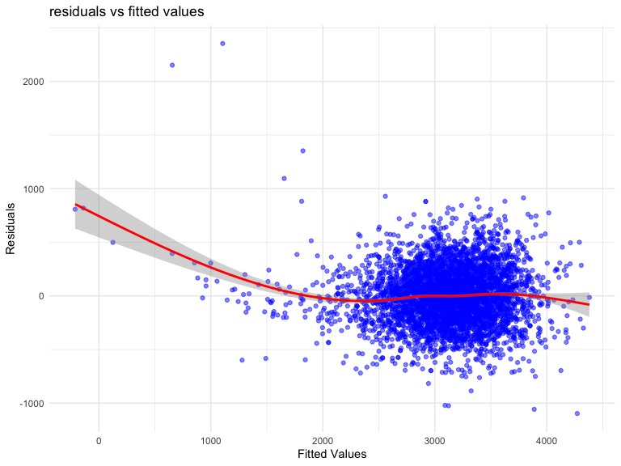
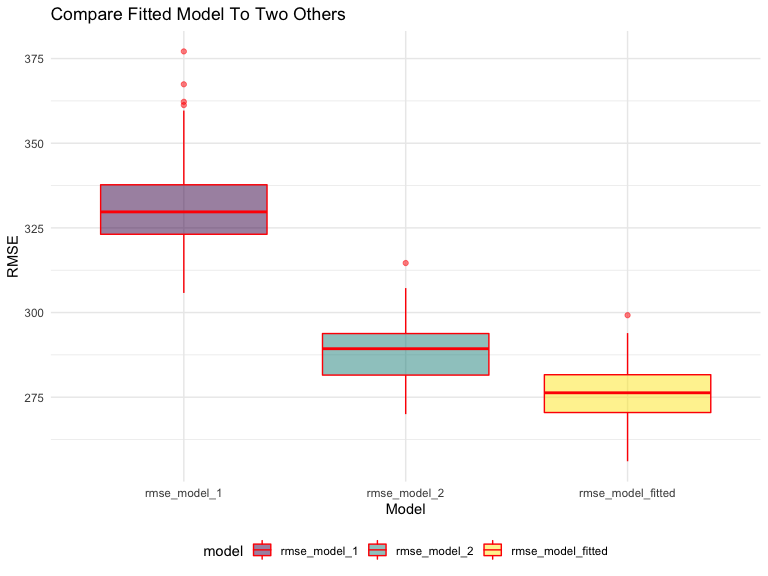
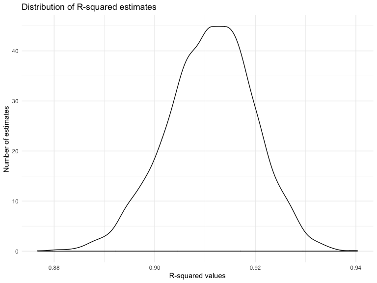
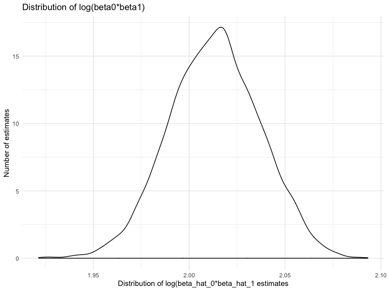

P8105\_hw6\_qy2234
================
Michael Yan
11/21/2019

# problem 1

``` r
#### load and clean the birthweight data
birthweight_data = read_csv("./data/birthweight.csv") %>%
  mutate(babysex = as.factor(babysex),
         frace = as.factor(frace),
         malform = as.factor(malform),
         mrace = as.factor(mrace))
```

    ## Parsed with column specification:
    ## cols(
    ##   .default = col_double()
    ## )

    ## See spec(...) for full column specifications.

``` r
#### check for missing data in all columns
birthweight_data %>% 
  summarise_all(funs(sum(is.na(.)))) %>% 
  knitr::kable()
```

| babysex | bhead | blength | bwt | delwt | fincome | frace | gaweeks | malform | menarche | mheight | momage | mrace | parity | pnumlbw | pnumsga | ppbmi | ppwt | smoken | wtgain |
| ------: | ----: | ------: | --: | ----: | ------: | ----: | ------: | ------: | -------: | ------: | -----: | ----: | -----: | ------: | ------: | ----: | ---: | -----: | -----: |
|       0 |     0 |       0 |   0 |     0 |       0 |     0 |       0 |       0 |        0 |       0 |      0 |     0 |      0 |       0 |       0 |     0 |    0 |      0 |      0 |

``` r
#### create a stepwise regression
fit_test = lm(bwt ~ ., data = birthweight_data)
step(fit_test, direction = 'backward')
```

    ## Start:  AIC=48717.83
    ## bwt ~ babysex + bhead + blength + delwt + fincome + frace + gaweeks + 
    ##     malform + menarche + mheight + momage + mrace + parity + 
    ##     pnumlbw + pnumsga + ppbmi + ppwt + smoken + wtgain
    ## 
    ## 
    ## Step:  AIC=48717.83
    ## bwt ~ babysex + bhead + blength + delwt + fincome + frace + gaweeks + 
    ##     malform + menarche + mheight + momage + mrace + parity + 
    ##     pnumlbw + pnumsga + ppbmi + ppwt + smoken
    ## 
    ## 
    ## Step:  AIC=48717.83
    ## bwt ~ babysex + bhead + blength + delwt + fincome + frace + gaweeks + 
    ##     malform + menarche + mheight + momage + mrace + parity + 
    ##     pnumlbw + ppbmi + ppwt + smoken
    ## 
    ## 
    ## Step:  AIC=48717.83
    ## bwt ~ babysex + bhead + blength + delwt + fincome + frace + gaweeks + 
    ##     malform + menarche + mheight + momage + mrace + parity + 
    ##     ppbmi + ppwt + smoken
    ## 
    ##            Df Sum of Sq       RSS   AIC
    ## - frace     4    124365 320848704 48712
    ## - malform   1      1419 320725757 48716
    ## - ppbmi     1      6346 320730684 48716
    ## - momage    1     28661 320752999 48716
    ## - mheight   1     66886 320791224 48717
    ## - menarche  1    111679 320836018 48717
    ## - ppwt      1    131132 320855470 48718
    ## <none>                  320724338 48718
    ## - fincome   1    193454 320917792 48718
    ## - parity    1    413584 321137922 48721
    ## - mrace     3    868321 321592659 48724
    ## - babysex   1    853796 321578134 48727
    ## - gaweeks   1   4611823 325336161 48778
    ## - smoken    1   5076393 325800732 48784
    ## - delwt     1   8008891 328733230 48823
    ## - blength   1 102050296 422774634 49915
    ## - bhead     1 106535716 427260054 49961
    ## 
    ## Step:  AIC=48711.51
    ## bwt ~ babysex + bhead + blength + delwt + fincome + gaweeks + 
    ##     malform + menarche + mheight + momage + mrace + parity + 
    ##     ppbmi + ppwt + smoken
    ## 
    ##            Df Sum of Sq       RSS   AIC
    ## - malform   1      1447 320850151 48710
    ## - ppbmi     1      6975 320855679 48710
    ## - momage    1     28379 320877083 48710
    ## - mheight   1     69502 320918206 48710
    ## - menarche  1    115708 320964411 48711
    ## - ppwt      1    133961 320982665 48711
    ## <none>                  320848704 48712
    ## - fincome   1    194405 321043108 48712
    ## - parity    1    414687 321263390 48715
    ## - babysex   1    852133 321700837 48721
    ## - gaweeks   1   4625208 325473911 48772
    ## - smoken    1   5036389 325885093 48777
    ## - delwt     1   8013099 328861802 48817
    ## - mrace     3  13540415 334389119 48885
    ## - blength   1 101995688 422844392 49908
    ## - bhead     1 106662962 427511666 49956
    ## 
    ## Step:  AIC=48709.53
    ## bwt ~ babysex + bhead + blength + delwt + fincome + gaweeks + 
    ##     menarche + mheight + momage + mrace + parity + ppbmi + ppwt + 
    ##     smoken
    ## 
    ##            Df Sum of Sq       RSS   AIC
    ## - ppbmi     1      6928 320857079 48708
    ## - momage    1     28660 320878811 48708
    ## - mheight   1     69320 320919470 48708
    ## - menarche  1    116027 320966177 48709
    ## - ppwt      1    133894 320984044 48709
    ## <none>                  320850151 48710
    ## - fincome   1    193784 321043934 48710
    ## - parity    1    414482 321264633 48713
    ## - babysex   1    851279 321701430 48719
    ## - gaweeks   1   4624003 325474154 48770
    ## - smoken    1   5035195 325885346 48775
    ## - delwt     1   8029079 328879230 48815
    ## - mrace     3  13553320 334403471 48883
    ## - blength   1 102009225 422859375 49906
    ## - bhead     1 106675331 427525481 49954
    ## 
    ## Step:  AIC=48707.63
    ## bwt ~ babysex + bhead + blength + delwt + fincome + gaweeks + 
    ##     menarche + mheight + momage + mrace + parity + ppwt + smoken
    ## 
    ##            Df Sum of Sq       RSS   AIC
    ## - momage    1     29211 320886290 48706
    ## - menarche  1    117635 320974714 48707
    ## <none>                  320857079 48708
    ## - fincome   1    195199 321052278 48708
    ## - parity    1    412984 321270064 48711
    ## - babysex   1    850020 321707099 48717
    ## - mheight   1   1078673 321935752 48720
    ## - ppwt      1   2934023 323791103 48745
    ## - gaweeks   1   4621504 325478583 48768
    ## - smoken    1   5039368 325896447 48773
    ## - delwt     1   8024939 328882018 48813
    ## - mrace     3  13551444 334408523 48881
    ## - blength   1 102018559 422875638 49904
    ## - bhead     1 106821342 427678421 49953
    ## 
    ## Step:  AIC=48706.02
    ## bwt ~ babysex + bhead + blength + delwt + fincome + gaweeks + 
    ##     menarche + mheight + mrace + parity + ppwt + smoken
    ## 
    ##            Df Sum of Sq       RSS   AIC
    ## - menarche  1    100121 320986412 48705
    ## <none>                  320886290 48706
    ## - fincome   1    240800 321127090 48707
    ## - parity    1    431433 321317724 48710
    ## - babysex   1    841278 321727568 48715
    ## - mheight   1   1076739 321963029 48719
    ## - ppwt      1   2913653 323799943 48743
    ## - gaweeks   1   4676469 325562760 48767
    ## - smoken    1   5045104 325931394 48772
    ## - delwt     1   8000672 328886962 48811
    ## - mrace     3  14667730 335554021 48894
    ## - blength   1 101990556 422876847 49902
    ## - bhead     1 106864308 427750598 49952
    ## 
    ## Step:  AIC=48705.38
    ## bwt ~ babysex + bhead + blength + delwt + fincome + gaweeks + 
    ##     mheight + mrace + parity + ppwt + smoken
    ## 
    ##           Df Sum of Sq       RSS   AIC
    ## <none>                 320986412 48705
    ## - fincome  1    245637 321232048 48707
    ## - parity   1    422770 321409181 48709
    ## - babysex  1    846134 321832545 48715
    ## - mheight  1   1012240 321998651 48717
    ## - ppwt     1   2907049 323893461 48743
    ## - gaweeks  1   4662501 325648912 48766
    ## - smoken   1   5073849 326060260 48771
    ## - delwt    1   8137459 329123871 48812
    ## - mrace    3  14683609 335670021 48894
    ## - blength  1 102191779 423178191 49903
    ## - bhead    1 106779754 427766166 49950

    ## 
    ## Call:
    ## lm(formula = bwt ~ babysex + bhead + blength + delwt + fincome + 
    ##     gaweeks + mheight + mrace + parity + ppwt + smoken, data = birthweight_data)
    ## 
    ## Coefficients:
    ## (Intercept)     babysex2        bhead      blength        delwt  
    ##   -6098.822       28.558      130.777       74.947        4.107  
    ##     fincome      gaweeks      mheight       mrace2       mrace3  
    ##       0.318       11.592        6.594     -138.792      -74.887  
    ##      mrace4       parity         ppwt       smoken  
    ##    -100.678       96.305       -2.676       -4.843

  - The results show that the model should include bwt ~ babysex + bhead
    + blength + delwt + fincome + gaweeks + mheight + mrace + parity +
    ppwt + smoken.

<!-- end list -->

``` r
#### test fitted regression model
fitted = lm(bwt ~ babysex + bhead + blength + delwt + fincome + gaweeks + mheight + mrace + parity + ppwt + smoken, data = birthweight_data)
summary(fitted)
```

    ## 
    ## Call:
    ## lm(formula = bwt ~ babysex + bhead + blength + delwt + fincome + 
    ##     gaweeks + mheight + mrace + parity + ppwt + smoken, data = birthweight_data)
    ## 
    ## Residuals:
    ##      Min       1Q   Median       3Q      Max 
    ## -1097.18  -185.52    -3.39   174.14  2353.44 
    ## 
    ## Coefficients:
    ##               Estimate Std. Error t value Pr(>|t|)    
    ## (Intercept) -6098.8219   137.5463 -44.340  < 2e-16 ***
    ## babysex2       28.5580     8.4549   3.378 0.000737 ***
    ## bhead         130.7770     3.4466  37.944  < 2e-16 ***
    ## blength        74.9471     2.0190  37.120  < 2e-16 ***
    ## delwt           4.1067     0.3921  10.475  < 2e-16 ***
    ## fincome         0.3180     0.1747   1.820 0.068844 .  
    ## gaweeks        11.5925     1.4621   7.929 2.79e-15 ***
    ## mheight         6.5940     1.7849   3.694 0.000223 ***
    ## mrace2       -138.7925     9.9071 -14.009  < 2e-16 ***
    ## mrace3        -74.8868    42.3146  -1.770 0.076837 .  
    ## mrace4       -100.6781    19.3247  -5.210 1.98e-07 ***
    ## parity         96.3047    40.3362   2.388 0.017004 *  
    ## ppwt           -2.6756     0.4274  -6.261 4.20e-10 ***
    ## smoken         -4.8434     0.5856  -8.271  < 2e-16 ***
    ## ---
    ## Signif. codes:  0 '***' 0.001 '**' 0.01 '*' 0.05 '.' 0.1 ' ' 1
    ## 
    ## Residual standard error: 272.3 on 4328 degrees of freedom
    ## Multiple R-squared:  0.7181, Adjusted R-squared:  0.7173 
    ## F-statistic: 848.1 on 13 and 4328 DF,  p-value: < 2.2e-16

  - Based on the results, we see that the adjusted R-squared is 0.7173
    which is resonable and the overall p-value is less than 0.05,
    therefore the variables used above to predict birthweight are chosen
    to be our predictors.

<!-- end list -->

``` r
#### plot of model residuals against fitted values 
birthweight_data %>% 
  add_predictions(model = fitted, var = "prediction") %>% 
  add_residuals(model = fitted, var = "residuals") %>%
  ggplot(aes(x = prediction, y = residuals)) + 
  geom_point(alpha = 0.5, color = "blue") +
  geom_smooth(color = "red") + 
  labs(title = "residuals vs fitted values", 
       y = "Residuals",
       x = "Fitted Values")
```

    ## `geom_smooth()` using method = 'gam' and formula 'y ~ s(x, bs = "cs")'



  - Based on the fitted line, which is suppose be around 0 residuals, we
    see that when the fitted value is low, outliers are present. In
    addition, outside the interval approximately from 2000-4000, the
    residuals are not normally distributed which is an indicator for
    unreliable model prediction.

<!-- end list -->

``` r
#### compare our model to two others
set.seed(1)

#### create training and testing dataset
crossv_mc(birthweight_data, 100) %>%
  mutate(train = map(train, as_tibble),
         test = map(test, as_tibble)) %>% 
# fit each of three models to this dataset 
    mutate(fitted = map(train, ~lm(bwt ~ babysex + bhead + blength + gaweeks + mheight + mrace + parity + ppwt + smoken, data = .x)),
           compare_model_1 = map(train, ~lm(bwt ~ blength + gaweeks, data = .x)),
           compare_model_2 = map(train, ~lm(bwt ~ babysex + blength + bhead + babysex * blength + babysex * bhead + blength * bhead + babysex * blength * bhead, data = .x))) %>% 
    mutate(rmse_model_fitted = map2_dbl(fitted, test, ~rmse(model = .x, data = .y)),
           rmse_model_1 = map2_dbl(compare_model_1, test, ~rmse(model = .x, data = .y)),
           rmse_model_2 = map2_dbl(compare_model_2, test, ~rmse(model = .x, data = .y))) %>% 
    select(starts_with("rmse")) %>% 
    gather(key = model, value = rmse) %>% 
  
#### plot the prediction error distribution for different models  
    ggplot(aes(x = model, y = rmse, fill = model)) + 
    geom_boxplot(alpha = .5, color = " red") + 
    labs(title = "Compare Fitted Model To Two Others",
       x = "Model",
       y = "RMSE")
```



  - In general, we want a model that has the lowest RMSE value. In this
    case, our fitted model has the lowest RMSE among all three models
    which indicates that our model outperform the other two.

## Problem 2

``` r
#### download weather dataset
weather_df = 
  rnoaa::meteo_pull_monitors(
    c("USW00094728"),
    var = c("PRCP", "TMIN", "TMAX"), 
    date_min = "2017-01-01",
    date_max = "2017-12-31") %>%
  mutate(
    name = recode(id, USW00094728 = "CentralPark_NY"),
    tmin = tmin / 10,
    tmax = tmax / 10) %>%
  select(name, id, everything())
```

    ## Registered S3 method overwritten by 'crul':
    ##   method                 from
    ##   as.character.form_file httr

    ## Registered S3 method overwritten by 'hoardr':
    ##   method           from
    ##   print.cache_info httr

    ## file path:          /Users/mqyan/Library/Caches/rnoaa/ghcnd/USW00094728.dly

    ## file last updated:  2019-09-04 12:46:51

    ## file min/max dates: 1869-01-01 / 2019-09-30

``` r
#### simple linear regression with tmax as the response and tmin as the predictor
weather_slr = lm(tmax ~ tmin, data = weather_df)
summary(weather_slr)
```

    ## 
    ## Call:
    ## lm(formula = tmax ~ tmin, data = weather_df)
    ## 
    ## Residuals:
    ##     Min      1Q  Median      3Q     Max 
    ## -6.0304 -2.1245  0.0264  1.7264  9.4915 
    ## 
    ## Coefficients:
    ##             Estimate Std. Error t value Pr(>|t|)    
    ## (Intercept)  7.20850    0.22635   31.85   <2e-16 ***
    ## tmin         1.03924    0.01699   61.16   <2e-16 ***
    ## ---
    ## Signif. codes:  0 '***' 0.001 '**' 0.01 '*' 0.05 '.' 0.1 ' ' 1
    ## 
    ## Residual standard error: 2.938 on 363 degrees of freedom
    ## Multiple R-squared:  0.9115, Adjusted R-squared:  0.9113 
    ## F-statistic:  3741 on 1 and 363 DF,  p-value: < 2.2e-16

\[\hat{Y} = 7.20850 + 1.03924X_i where Y = tmax and X = tmin\]

``` r
#### r-squared estimate and log(beta_hat_0*beta_hat_1)

# write a function for bootstrap
bootstrap_function = function(x){
  
  model_1 =
    x %>% 
    broom::tidy()
  
  model_2 =
    x %>%
    broom::glance()
  
  tibble(
    r_squared = pull(model_2, adj.r.squared),
    log_beta0_beta1 = log(pull(model_1, estimate)[1] * pull(model_1, estimate)[2]))
  
}

# generate the bootstrap samples and caculate the estimates for r_squared and log(beta_hat_0*beta_hat_1)
estimates = 
 weather_df %>% 
  modelr::bootstrap(n = 5000) %>% 
  mutate(
    models = map(strap, ~ lm(tmax ~ tmin, data = .x)),
    results = map(models, bootstrap_function)) %>% 
  unnest(results) %>%
  select(-strap, -models) %>% 
  rename("estimate number" = `.id`) 
```

``` r
#### plot showing the distribution of the estimates of R-squared
estimates %>% 
  ggplot(aes(x = r_squared)) +
  geom_density() +
  labs(title = "Distribution of R-squared estimates", 
       x = "R-squared values",
       y = "Number of estimates")
```



``` r
#### plot showing the distribution of the estimates of log(beta_hat_0*beta_hat_1)
estimates %>% 
  ggplot(aes(x = log_beta0_beta1)) +
  geom_density() +
  labs(title = "Distribution of log(beta0*beta1)", 
       x = "Distribution of log(beta_hat_0*beta_hat_1 estimates",
       y = "Number of estimates")
```



Based on the ditribution of R-squared we see a approximately noraml
distribution with a tail towards the left side which indicates that
there might be potential outliers with low R-squared value.

Based on the distribution of log(beta\_hat\_0\*beta\_hat\_1) we also see
a approximately normal distribution with a tail towards the left side
which indicates that there might be potential outliers with low
R-squared value.

``` r
#### 95% confidence interval, R-squared
quantile(estimates$r_squared, c(.025, .975))
```

    ##      2.5%     97.5% 
    ## 0.8934048 0.9272809

``` r
#### 95% confidence interval, log(beta_hat_0*beta_hat_1)
quantile(estimates$log_beta0_beta1, c(.025, .975))
```

    ##     2.5%    97.5% 
    ## 1.966942 2.058528
